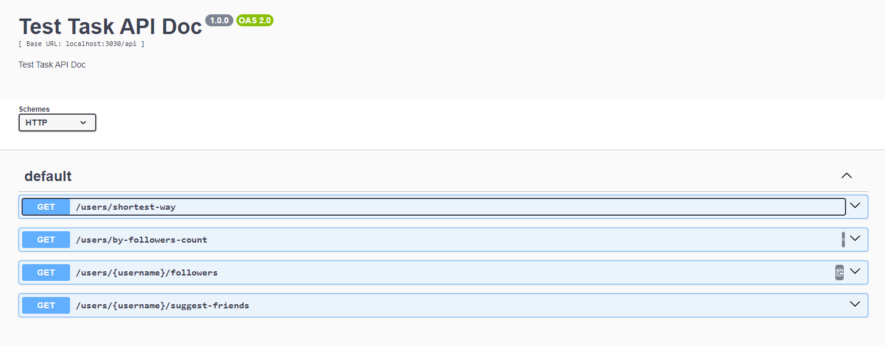

# neo4j-test-task


## Project Components

1. **Neo4j Database**: A graph database to store users and their relationships.
2. **Express Application**: A server that provides API endpoints to interact with the database.

## Getting Started

### Prerequisites

Before you begin, make sure you have these installed:

- [Docker](https://www.docker.com/get-started)
- [Docker Compose](https://docs.docker.com/compose/install/)

### Installation

1. **Clone the Repository**

   ```bash
   git clone https://github.com/andrew-semeniuk-99/neo4j-test-task.git
   cd neo4j-test-task
   ```
2. **Create a `.env` file  from  `.env.example`**
3. **Starting the Project**
   Use Docker Compose to build and start the services:

   ```bash
   docker-compose up --build -d
   ```

### Using Endpoints

To use the API endpoints, go to the Swagger documentation by following this link:

[Swagger API Documentation](http://localhost:3030/api-docs/)

(http://localhost:3030/api-docs/)

Swagger makes it easy to test and view available endpoints, along with their parameters and responses.




### API Endpoints

The Express application provides several API endpoints to interact with the Neo4j database. Each endpoint performs specific operations on the user data, such as finding followers, suggesting friends, or identifying the shortest path between users.

#### GET /shortest-way

- **Description**: This endpoint finds the shortest path between two users in the social network based on their `FOLLOWS` relationships.
- **Endpoint**: `/shortest-way`
- **Method**: `GET`
- **Parameters**:
   - `leftUser` (query) – The username of the first user (start point).
   - `rightUser` (query) – The username of the second user (end point).
- **Response**:
   - `200 OK`: Returns the list of usernames that form the shortest path between the two users.
   - `404 Not Found`: If no path is found between the two users.
   - `500 Internal Server Error`: In case of any server-related issues.

**Example Request**:

```http
GET http://localhost:3030/shortest-way?leftUser=bob&rightUser=dave 
```

#### GET /by-followers-count

- **Description**: This endpoint retrieves a list of users who have a minimum number of followers.
- **Endpoint**: `/by-followers-count`
- **Method**: `GET`
- **Parameters**:
   - `minFollowers` (query) – The minimum number of followers a user must have to be included in the response.
- **Response**:
   - `200 OK`: Returns the list of users who meet the minimum followers requirement.
   - `400 Bad Request`: If the `minFollowers` parameter is missing or invalid.
   - `500 Internal Server Error`: In case of any server-related issues.

**Example Request**:

```http
GET http://localhost:3030/by-followers-count?minFollowers=2
```

#### GET /:username/followers

- **Description**: This endpoint retrieves a list of users who follow a specific user.
- **Endpoint**: `/:username/followers`
- **Method**: `GET`
- **Parameters**:
   - `username` (path) – The username of the user whose followers are to be retrieved.
- **Response**:
   - `200 OK`: Returns a list of users who follow the specified user.
   - `404 Not Found`: If the user with the given username is not found.
   - `500 Internal Server Error`: In case of any server-related issues.

**Example Request**:

```http
GET http://localhost:3030/carol/followers
```

#### GET /:username/suggest-friends

- **Description**: This endpoint suggests friends for a specific user. It suggests users who are followed by the people the given user follows but are not directly followed by the user.
- **Endpoint**: `/:username/suggest-friends`
- **Method**: `GET`
- **Parameters**:
   - `username` (path) – The username of the user for whom friend suggestions are being made.
- **Response**:
   - `200 OK`: Returns a list of suggested friends for the specified user.
   - `404 Not Found`: If the user with the given username is not found or no suggestions are available.
   - `500 Internal Server Error`: In case of any server-related issues.

**Example Request**:

```http
GET http://localhost:3030/alice/suggest-friends
```


### How the Database is Populated via `indexes.cypher`

The `indexes.cypher` file contains a set of Cypher commands that create and populate the Neo4j database with the necessary structure, such as nodes, relationships, and indexes.

### Database Queries

All the queries to the Neo4j database are managed in the `repositories/users.js` file. This file contains the logic for interacting with the database, including operations such as finding users, retrieving followers, suggesting friends, and finding the shortest path between users.

- The API endpoints use functions from this repository to communicate with the database.
- Each function in `users.js` handles specific queries and returns the necessary data to the Express controllers, which then send the response back to the client.

By organizing database interactions in this file, the project maintains a clear separation of concerns, making it easier to manage and scale.
